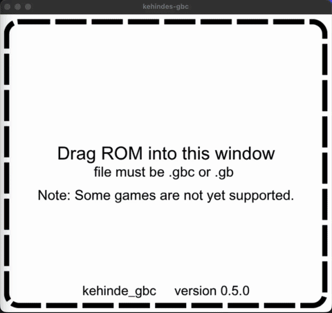

# kehinde-gbc
### a Game Boy Color emulator implementation by Kehinde Adeoso


---

kehinde-gbc is a Game Boy Color emulator. It accurately implements the SM83 CPU core, memory bus and the PPU with cycle-accurate scanline timing. The emulator also uses SDL2 for display out and input.

Licensed under the MIT License. See [LICENSE](LICENSE)

## Quickstart

---

### Option A: Access via Releases

The easiest way to use this emulator is via releases.

Download the executable for macOS via the latest release. Other executables will be included soon.

Gatekeeper Note: Depending on the version, the emulator may not be properly signed for macOS, so opening the file may not be allowed. To bypass protections:
1. Attempt to open the file. If you get a warning that it can't be opened, continue to step 2.
2. Close the dialog and go to Systems Settings
3. Navigate to Privacy and Security and scroll to the bottom
4. Allow the app to run on machine.
5. Attempt to open the app again. If prompted, confirm Open on the dialog.


### Option B: Build from source

> Currently, building from source is only supported on macOS.

First, download [Homebrew](https://brew.sh), then:
```bash
brew install sdl2 sdl2_image
```

After, do the following:
```bash
cmake -S build-sys -B build-sys/build
cmake --build build-sys/build
```

Then launch the app directly and follow the instructions on screen, or do the following:
```bash
./build-sys/build/kehindes_gameboycolor_emulator.app/Contents/MacOS/kehindes_gameboycolor_emulator path/to/rom.gb
```

## How to Use

---

Playing a game is as easy as launching the emulator and dragging your desired game file (must be either .gb or .gbc) into the box.

Once done, play games using the following controls:

- Movement:
 - W, A, S, and D are Up, Left, Down, and Right
- N is A
- M is B
- Enter is Start
- RShift is Select

## Attribution

Test suites and commercial ROMs used during development are not included in this repository (kept local/private); they're referenced here for credit.

**Test ROM suites & tools**
- [Blargg's Game Boy test ROMs](https://github.com/retrio/gb-test-roms) — CPU instruction, timing, and interrupt correctness tests.
- [Mooneye Test Suite](https://github.com/Gekkio/mooneye-test-suite) by Joonas Javanainen (Gekkio) — hardware-accuracy acceptance tests.
- [cgb-acid2](https://github.com/mattcurrie/cgb-acid2) by Matt Currie — CGB PPU rendering-accuracy test.
- [gameboy-doctor](https://github.com/robert/gameboy-doctor) — CPU trace-diffing tool used during SM83 core bring-up.

**Libraries**
- [SDL2](https://www.libsdl.org/) — display, input, and audio output.
- [SDL2_image](https://github.com/libsdl-org/SDL_image) — loads the drop-a-ROM prompt image.

**Commercial ROMs**
Used locally and solely for personal compatibility testing against real games. Property of their respective publishers/Nintendo — not distributed here.
- Tetris DX
- Pokémon Crystal Version
- Super Mario Bros. Deluxe
- 007: The World Is Not Enough
